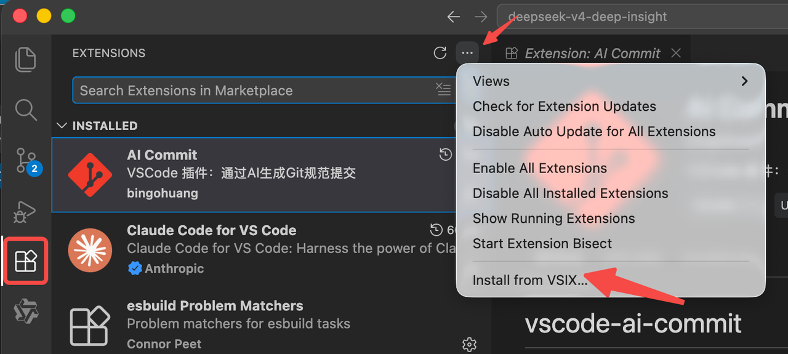
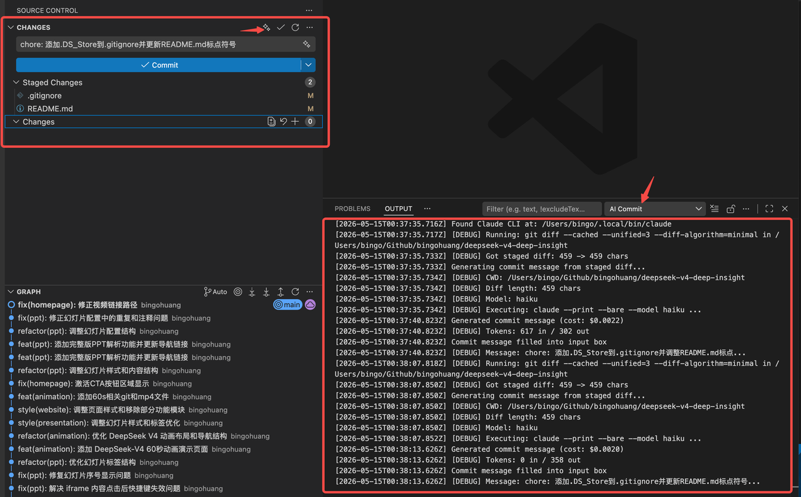

# vscode-ai-commit

【AI开发教程】如何用AI帮你定制开发VS Code插件

## 一、初始化 VS Code 插件工程

本地先安装 Node 和 Git，当然 vscode IDE 也是必须的 :)

使用 Yeoman 和 VS Code Extension Generator 为搭建脚手架项目，为开发做好准备。

```bash
npm install --global yo generator-code

yo code
```

选择 TypeScript Extension 项目类型：

```sql

     _-----_     ╭──────────────────────────╮
    |       |    │   Welcome to the Visual  │
    |--(o)--|    │   Studio Code Extension  │
   `---------´   │        generator!        │
    ( _´U`_ )    ╰──────────────────────────╯
    /___A___\   /
     |  ~  |     
   __'.___.'__   
 ´   `  |° ´ Y ` 

`list` prompt is deprecated. Use `select` prompt instead.
✔ What type of extension do you want to create? New Extension (TypeScript)
✔ What's the name of your extension? vscode-ai-commit
✔ What's the identifier of your extension? vscode-ai-commit
✔ What's the description of your extension? VSCode 插件：通过AI生成Git规范提交
✔ Initialize a git repository? Yes
`list` prompt is deprecated. Use `select` prompt instead.
✔ Which bundler to use? unbundled
`list` prompt is deprecated. Use `select` prompt instead.
✔ Which package manager to use? npm

Writing in /Users/bingo/Github/bingohuang/vscode-ai-commit...
   create vscode-ai-commit/.vscode/extensions.json
   create vscode-ai-commit/.vscode/launch.json
   create vscode-ai-commit/.vscode/settings.json
   create vscode-ai-commit/.vscode/tasks.json
   create vscode-ai-commit/package.json
   create vscode-ai-commit/tsconfig.json
   create vscode-ai-commit/.vscodeignore
   create vscode-ai-commit/vsc-extension-quickstart.md
   create vscode-ai-commit/.gitignore
   create vscode-ai-commit/README.md
   create vscode-ai-commit/CHANGELOG.md
   create vscode-ai-commit/src/extension.ts
   create vscode-ai-commit/src/test/extension.test.ts
   create vscode-ai-commit/.vscode-test.mjs
   create vscode-ai-commit/eslint.config.mjs
```

## 二、运行并优化项目工程

优化 README.md

补充 LICENSE

可以先提交一次代码：chore(project): 初始化项目基础配置文件 by `yo code`

用 vscode 测试运行：

打开打开 src/extension.ts，然后按 F5 键或运行命令 Debug:从命令面板 (Shift ⌘P) 开始调试。这将在新的扩展开发主机窗口中编译和运行扩展。

在新窗口中从命令面板 (Shift ⌘P) 运行 Hello World 命令：

&#x20;

可以先看看看看效果


优化vscode插件运行参数：.vscode/launch.json

```bash
{
    "version": "0.2.0",
    "configurations": [
       {
          "name": "Run Extension",
          "type": "extensionHost",
          "request": "launch",
          "args": [
             "--extensionDevelopmentPath=${workspaceFolder}",
             "--disable-extensions"
          ],
          "outFiles": [
             "${workspaceFolder}/out/**/*.js"
          ],
          "preLaunchTask": "${defaultBuildTask}"
       }
    ]
}
```

优化 package.json

```bash
{
  "name": "ai-commit",
  "displayName": "AI Commit",
  "description": "VSCode 插件：通过AI生成Git规范提交",
  "version": "0.0.1",
  "publisher": "bingohuang",
  "author": {
    "name": "Bingo Huang"
  },
  "license": "MIT",
  "repository": {
    "type": "git",
    "url": "https://github.com/bingohuang/vscode-ai-commit"
  },
  "homepage": "https://github.com/bingohuang/vscode-ai-commit",
  "bugs": {
    "url": "https://github.com/bingohuang/vscode-ai-commit/issues"
  },
  "icon": "icon.png",
  "galleryBanner": {
    "color": "#0f172a",
    "theme": "dark"
  },
  "engines": {
    "vscode": "^1.110.0"
  },
  "categories": [
    "SCM Providers",
    "Machine Learning",
    "Other"
  ],
  "keywords": [
    "ai",
    "commit",
    "git",
    "claude",
    "openai",
    "conventional",
    "commit-message"
  ],
  "activationEvents": [],
  "main": "./out/extension.js",
  "contributes": {
    "commands": [
      {
        "command": "vscode-ai-commit.helloWorld",
        "title": "Hello World"
      }
    ]
  },
  "scripts": {
    "vscode:prepublish": "npm run compile",
    "compile": "tsc -p ./",
    "watch": "tsc -watch -p ./",
    "pretest": "npm run compile && npm run lint",
    "lint": "eslint src",
    "test": "vscode-test"
  },
  "devDependencies": {
    "@types/vscode": "^1.120.0",
    "@types/mocha": "^10.0.10",
    "@types/node": "22.x",
    "typescript-eslint": "^8.56.1",
    "eslint": "^9.39.3",
    "typescript": "^5.9.3",
    "@vscode/test-cli": "^0.0.12",
    "@vscode/test-electron": "^2.5.2"
  }
}
```

构建和打包：

```bash
# 全局安装下 vsce
npm -g install @vscode/vsce

# 修改 package.json
"package": "vsce package"

# 执行打包命令
npm run package
```

最初始化的vscode插件：`files/ai-commit-0.0.1.vsix`

直接在 vscode 中安装看看效果

## 三、安装好AI工具，配置好AI模型

1、Claude Code

2、CC-Switch

3、配置好 LLM API


进入 claude，验证和测试

```bash
claude

# 看看模型是否配置好
/model

# 测试下claude 和 模型
/init

```


## 三、配合AI工作流框架来提高Harness

当前市面上有不少的AI开发工作流框架，可以提高开发过程的效率，增强AI的Harness，并记录和AI交互的过程

* **Trellis**：循环、有状态`需求 → 创建task → 分配Agent → 执行 → 记录记忆 → 迭代`

    * 有状态：workspace 持久化上下文，支持断点续做

    * 适合：大型项目、多模块协作、长期迭代、团队共享

* **OpenSpec**：

* **Spec-Kit**：

* **SuperPowers**：

当前先选型 **Trellis&#x20;**&#x6765;做开发实践：https://github.com/mindfold-ai/Trellis

```bash
# 1. 安装 Trellis
npm install -g @mindfoldhq/trellis@latest

# 2、版本
trellis -v
0.5.15

# 2. 在仓库中初始化
# 默认使用git username
trellis init

# 显示指定 username，交互选择平台
trellis init -u bingohuang

# 只初始化claude code 平台
trellis init --claude -u bingohuang

# 交互选择模板，我选空
? Select a spec template: 
❯ from scratch (default)
```


用 LLM + Claude Code + Trellis 开始头脑风暴：

```bash
/trellis-brainstorm 我想开发一个 VSCode 插件，支持通过 AI（如Claude Code） 来帮忙生成规范性的Commit Message。

当前已经初始化了 VSCode 插件工程，能正常运行、构建、打包。

先实现 MVP：
- 一键生成提交信息：VS Code Git 面板内置生成按钮
- 复用本地 Claude CLI：直接调用已安装的 Claude 客户端，无需额外 API 密钥和订阅
- 上下文智能分析：读取 Git 代码差异，生成规范、有业务含义的标准化提交信息

先做调研、设计和阶段任务拆分，等我确定后再分阶段实现。
```

AI 返回：

```markdown
PRD 已写入。现在进入关键问题环节。

  ---
  我理解你想要实现的目标。在做设计决策前，让我先扩展一下思维，避免后续返工：
  
  1. 未来演进：MVP 之后可能支持多 AI 提供商、自定义 prompt、Gitmoji 模式
  2. 关联场景：用户可能期望在 Command Palette 也能触发，不仅是 SCM 按钮
  3. 失败/边界：Claude CLI 认证过期、大型 diff 超时、hooks 干扰输出

  对于 MVP，你想包含哪些？

  1. 仅当前需求（最小可行——SCM 按钮 + Claude CLI + Conventional Commits）
  2. 加 Command Palette 入口（多一个触发点，成本低）
  3. 加 streaming 进度反馈（生成中实时显示，体验更好但复杂度高）
  4. 其他偏好

  另外，调研中发现了一个关键矛盾需要你决策：

  ▎ --bare 模式调用 Claude CLI 速度更快、输出干净（跳过 hooks/插件），但无法使用 OAuth 订阅认证，必须设 ANTHROPIC_API_KEY。
  ▎ 不用 --bare 可以复用订阅认证，但会加载本地 hooks（如 Trellis），可能注入无关文本到输出中。

  你倾向哪种方式？

  1. 不用 --bare（复用订阅认证 + 用 --system-prompt 覆盖系统提示来减少 hooks 干扰）
  2. 用 --bare（干净输出 + 要求用户配 ANTHROPIC_API_KEY）
  3. 双模式（默认非 bare 用订阅，提供设置切换为 bare + API key）
```

我们进一步明确需求，输入：

```bash
首先，关于bare模式，选用1. 不用 --bare（复用订阅认证 + 用 --system-prompt 覆盖系统提示来减少 hooks 干扰）

对于MVP：
**核心需求：**
- 使用 Claude CLI (claude-code) 分析 git diff 并生成提交信息
- 支持 conventional commits 格式（feat/fix/docs/style/refactor/test/chore）
- 在 VSCode SCM 面板添加按钮触发，同时添加Command Palette 入口
- 生成的消息自动填充到 commit input box

**技术要求：**
- TypeScript + VSCode Extension API
- 调用系统 claude CLI（非 API）
- 完善的错误处理和日志输出
- 支持设置中自定义 Claude 路径配置
- 支持设置选项配置 Debug 模式（Output Channel 详细日志）

**关键特性：**
1. 智能检测 Claude CLI 路径（PATH、nvm、brew 等）
2. 优先分析 staged changes，降级到 unstaged
3. Base64 编码 prompt 避免 shell 转义问题
4. JSON 格式输出，解析 result 字段
5. 会话管理（session-id + session name），每次生成提交都是一次会话，能在Claude中看到会话历史记录，注意加入 cwd，能将历史记录保存到正确的位置。


**参考实现要点：**
- 使用 `git diff --cached` 和 `git diff` 获取变更
- Claude 命令参数：--print --output-format json --dangerously-skip-permissions
- 通过 vscode.extensions.getExtension('vscode.git') 获取仓库信息


构建完整的 extension.ts 和 package.json，包含所有必要的配置和命令注册。

用Trellis记录完整的spec过程。
```

> MVP外的需求，可以先在小本本上记录下来，后续再逐步迭代：

```bash

- 进度条显示生成过程，支持取消
- 自定义提交prompt
```

明确后，AI开始收敛和实现：

```bash
好的，决策已明确。让我更新 PRD 收敛所有决策点。

PRD 已收敛。现在整理 jsonl 上下文文件。

现在编写 jsonl 上下文文件。

jsonl 已整理。现在激活任务。

任务已激活。现在开始实现。
```


中途中断了：

```bash
/trellis:continue 刚刚IDE卡住中断了，继续。
```

如果任务完成：

```bash
/trellis:finish-work
```

如果有问题，随时让AI修复：

```bash
执行claude命令报错：error: unknown option '--cwd'，请修复
```

发现速度慢，让AI优化：

```bash
该插件在执行claude命令，生成git message时，会很慢，大概要10秒以上，我希望能优化到5秒内，可以结合多种方案。
先通过 trellis 创建 spec 任务和文档，确认后再执行。
```


功能迭代，希望插件的每次提交也有Claude Code 的历史记录：

```bash
我希望插件每次调用的claude命令，要有 session id，要有session历史记录， 方便通过claude查看到历史记录。

最轻量化实现：仅需要在claude的执行命令添加 session id，能让claude有历史记录，我可以自己去claude查看历史记录即可
```

***

## 四、一个初步可用的 vscode 插件：用AI帮你做Git规范提交

`files/ai-commit-0.1.2.vsix`

下载后，直接在vscode（包括它的演示IDE，比如Trae、Cursor）中安装






